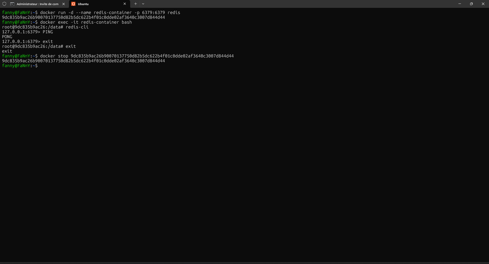
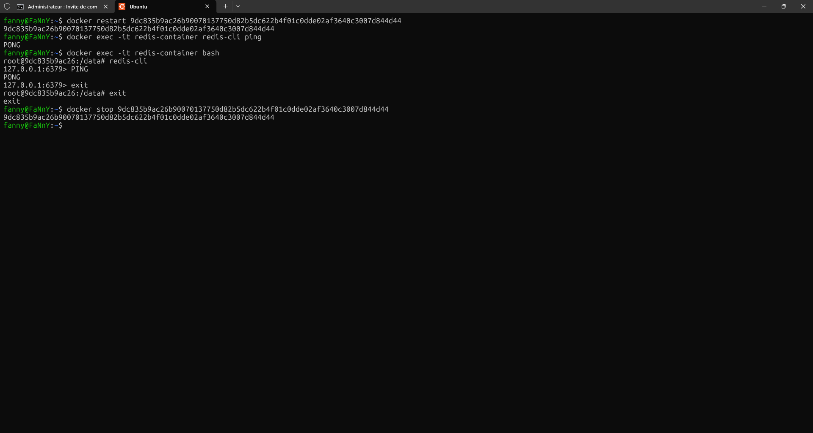

# REDIS

## Vocabulaire / Définitions

- **Redis** : Base de données NoSQL en mémoire, orientée clé-valeur, utilisée pour le cache, la gestion de sessions, la file d’attente, etc.
- **NoSQL** : Type de base de données non relationnelle, adaptée au stockage de grandes quantités de données non structurées ou semi-structurées.
- **Clé-Valeur** : Modèle de stockage où chaque donnée est associée à une clé unique.
- **Cache** : Mémoire temporaire permettant d’accélérer l’accès aux données fréquemment utilisées.
- **Session** : Données temporaires associées à un utilisateur lors de sa connexion à une application.
- **File d’attente (pub/sub)** : Système de communication asynchrone où des messages sont publiés sur des canaux et reçus par les abonnés, permettant la transmission d’informations entre différents services ou applications.
- **Stockage de données temporaires (compteurs, classements, etc.)** : Utilisation de Redis pour conserver des valeurs numériques ou des listes (scores, rangs, compteurs d’événements) qui évoluent rapidement et nécessitent des accès rapides.
- **Container Docker** : Environnement isolé permettant d’exécuter des applications avec toutes leurs dépendances.
- **Image Docker** : Modèle ou « template » utilisé pour créer un container Docker.
- **redis-cli** : Outil en ligne de commande pour interagir avec un serveur Redis.
- **PING/PONG** : Commande de test de connexion à Redis ; PING attend une réponse PONG.

## Qu'est-ce que Redis ?

Redis (REmote DIctionary Server) est une base de données NoSQL en mémoire, orientée clé-valeur, open source et très performante. Elle est principalement utilisée comme base de données, cache, broker de messages ou file d'attente. Redis stocke les données en mémoire pour des accès ultra-rapides, mais peut aussi les persister sur disque.

### À quoi sert Redis ?

- **Cache** : accélérer les applications en stockant des données temporaires.
- **Session store** : gestion des sessions utilisateurs.
- **File d'attente/pub-sub** : communication entre services.
- **Stockage de données temporaires** : compteurs, classements, etc.

### Comment ça marche ?

Redis fonctionne en stockant toutes les données en mémoire (RAM), ce qui permet des lectures et écritures très rapides. Il propose différents types de structures de données (chaînes, listes, ensembles, hachages, etc.) et expose une interface simple via des commandes en ligne ou des clients pour de nombreux langages.

## Pourquoi parle-t-on autant de Redis ?

Redis est très populaire car il s'agit d'une base de données NoSQL en mémoire extrêmement rapide, idéale pour améliorer les performances des applications. On l'utilise principalement comme cache, gestionnaire de sessions, file d’attente (pub/sub) et pour stocker des données temporaires (compteurs, classements, etc.). Sa simplicité, sa rapidité (tout est en RAM), sa polyvalence (plusieurs structures de données) et sa compatibilité avec de nombreux langages en font un outil incontournable dans le développement moderne, notamment pour les architectures distribuées et les applications à forte charge.

---

## Lancer un container Redis avec Docker

1. **Chercher l'image Redis sur DockerHub**
   - [Lien DockerHub Redis](https://hub.docker.com/_/redis)
2. **Lancer un container nommé `redis-container`** :
   ```bash
   docker run -d --name redis-container -p 6379:6379 redis
   ```
3. **Rentrer dans le container** :
   ```bash
   docker exec -it redis-container bash
   ```
4. **Se connecter à la base Redis depuis l'intérieur du container** :
   ```bash
   redis-cli
   ```
5. **Tester la connexion avec la commande PING** :
   ```bash
   PING
   # Réponse attendue : PONG
   ```

---

## Récapitulatif des commandes Docker/Redis

| Étape                      | Commande                                                  |
| -------------------------- | --------------------------------------------------------- |
| Lancer le container Redis  | `docker run -d --name redis-container -p 6379:6379 redis` |
| Lister les containers      | `docker ps`                                               |
| Redémarrer le container    | `docker restart redis-container` ou `docker restart <ID>` |
| Entrer dans le container   | `docker exec -it redis-container bash`                    |
| Lancer le client Redis     | `redis-cli`                                               |
| Tester la connexion        | `PING`                                                    |
| Sortir du container Docker | `exit`                                                    |
| Arrêter le container       | `docker stop redis-container`                             |
| Supprimer le container     | `docker rm redis-container`                               |

---

## Testé sous Ubuntu

Toutes les commandes ci-dessus ont été testées dans un terminal Ubuntu (voir capture d'écran ci-dessous).




---

> N'hésitez pas à consulter la documentation officielle de [Redis](https://redis.io/) et de [Docker](https://docs.docker.com/) pour plus d'informations.

---
